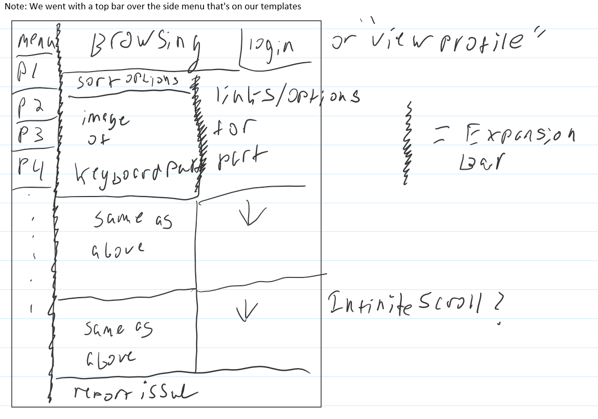
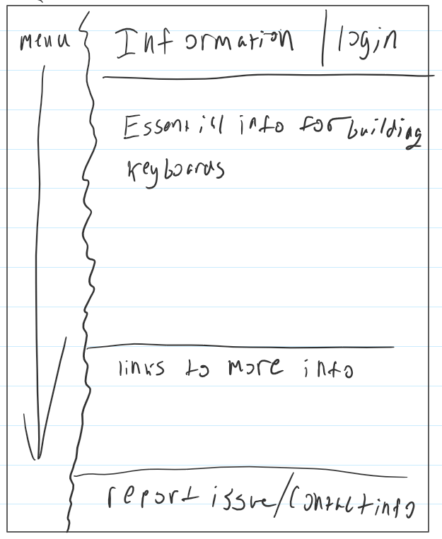
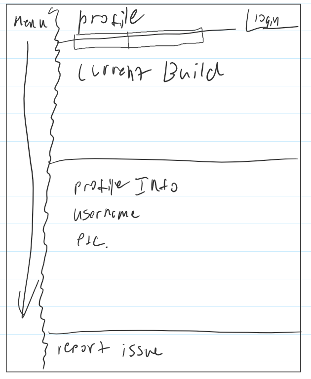
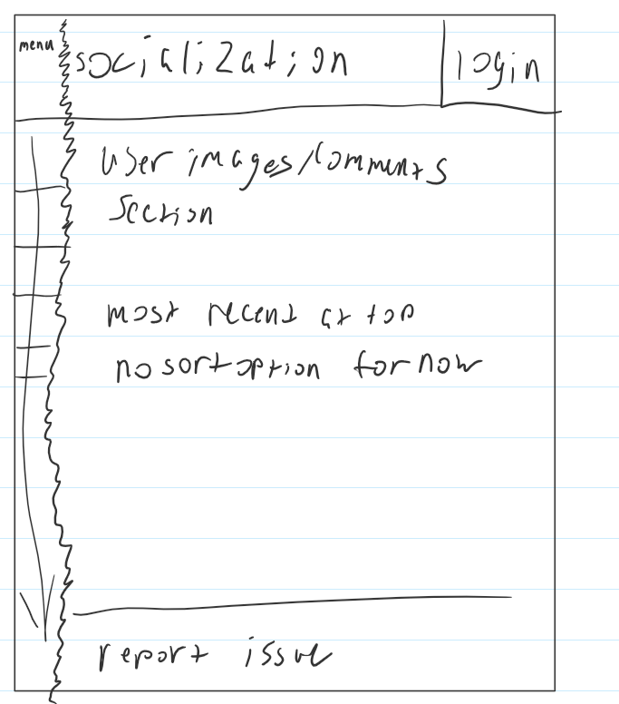
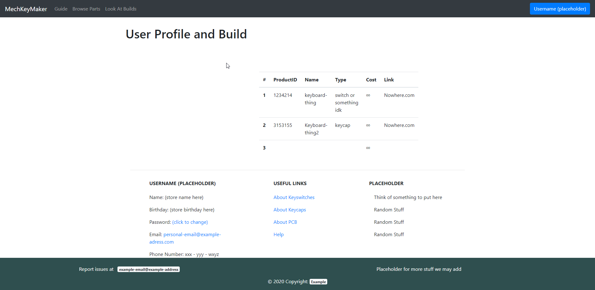

# Part 0: Data Interactions
Unchanged from milestone 0

# Breakdown of Work:
Andrew Leger:
    Drew all the wireframes while discussing with partners
    
    Completed the profile page.
    
    Modified the template page that Justin wrote most of, fixing bugs and rearranging some stuff. 
    Specifically: Moved body tag to end where it should be, took the center three columns out of the footer class (it shouldn't be a footer, but a row of a container), made the body tag not a container, but put a conatiner inside the body withing its own div, added a footer with bottom positioning. Added support for styles.css file, Added comments
    
    Also, I did make the styles.css page, now that I think of it.^

    Am currently writing most of this milestone1.md. Or atleast most of what's relevant to me / the framework for it.

# Part 1: Wireframes/Templates

Template For browsing page.
Note that we changed our implemenation when writing the html a little, so the sidebar on every wireframe is replaced with a top navigation bar.

Template For info page.

Template For profile page.

Template For social page.

# Part 2: Screenshots of pages in browser

<!-- Teammates place your screenshots of the respective page you did in the images folder and then change the link. -->
<!-- Also, please name them <something>_page_browser.png to be consistent -->
Actual browsing page in bootstrap

Actual info page in bootstrap

Actual profile page in bootstrap

The profile page consists of both your user information on the bottom half of the screen, as well as the build information for the mechanical keyboard you plan on building. Current setup for this part is a simple table (currently filled with dummy values) that houses information like the product id number, it's name, what part it is, the link to the product, etc.

Actual social page in bootstrap

