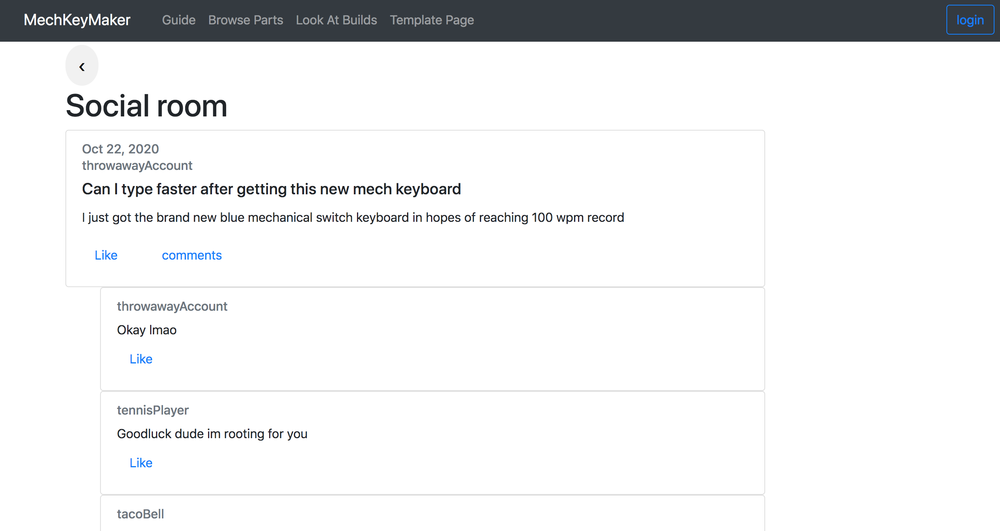

# Part 0: Data Interactions
Unchanged from milestone 0

# Breakdown of Work:
### Andrew Leger:

Drew all the wireframes while discussing with partners

Completed the profile page.

Modified the template page that Justin wrote most of, fixing bugs and rearranging some stuff. 
Specifically: Moved body tag to end where it should be, took the center three columns out of the footer class (it shouldn't be a footer, but a row of a container), made the body tag not a container, but put a conatiner inside the body withing its own div, added a footer with bottom positioning that looks pretty. Added support for styles.css file, Added comments

Also, I did make the styles.css page, now that I think of it.^

Am currently writing most of this milestone1.md. Or atleast most of what's relevant to me / the framework for it.

### Justin Diep:

Helped with discussion about wireframe with the group.

Completed Info Page.
Helped with Browsing Page.

Created the original Template html which is used for all pages. Navbar and original footer. Footer was later modified.
Originally made HomePage html as well however that idea was scrapped. Could come back to it later.

### Long Vo:

# Part 1: Wireframes/Templates

### Template For browsing page.
Note that we changed our implemenation when writing the html a little, so the sidebar on every wireframe is replaced with a top navigation bar.

### Template For info page.

### Template For profile page.

### Template For social page.

# Part 2: Screenshots of pages in browser

<!-- Teammates place your screenshots of the respective page you did in the images folder and then change the link. -->
<!-- Also, please name them <something>_page_browser.png to be consistent -->
### Actual Browsing Page in bootstrap

The browsing page will be where users can search for parts based on their personal preferences. There is a search bar at the top if
the user wants to search for any specific part, or if they want to search by keyword. Underneath the Search bar will be 4 dropdown
buttons for each respective component of a custom mechanical keyboard and on the far right side is sort button which will sort the product listings by price or rating.

### Actual Info Page in bootstrap

The information page is where the users can learn more about mechanical keyboards and the parts which make up one. Here they can also learn about the many different types of each mechanical keyboard component. Additionally links to other resources will be added at the end for further information. This might just be made into a reference section and I will try to incorporate all information onto this page.

### Actual Profile Page in bootstrap

The profile page consists of both your user information on the bottom half of the screen, as well as the build information for the mechanical keyboard you plan on building. Current setup for this part is a simple table (currently filled with dummy values) that houses information like the product id number, it's name, what part it is, the link to the product, etc.

### Actual Social Page in bootstrap

