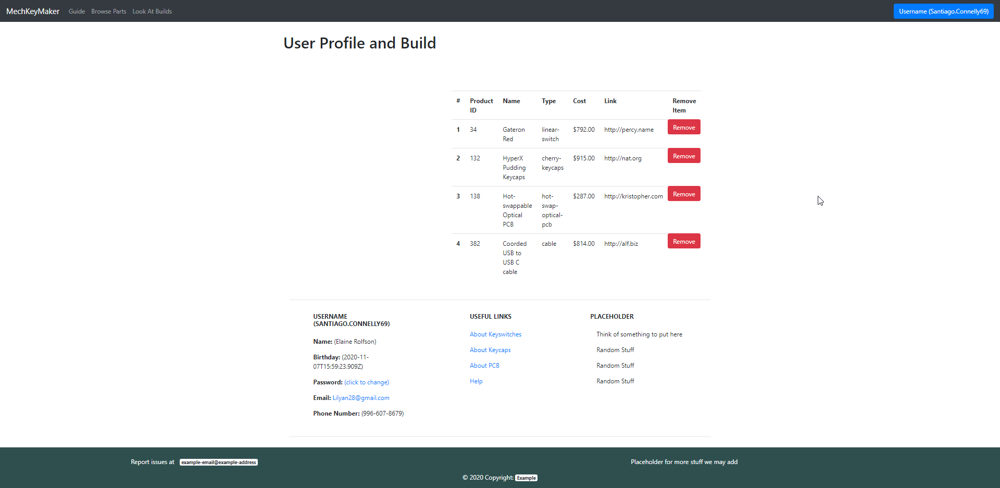
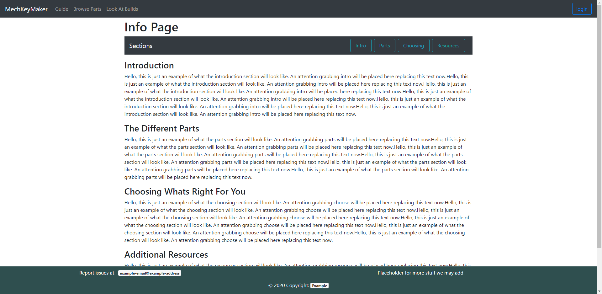

# Breakdown of Work
### Andrew Leger:
    Figured out with Justin most of the API stuff we needed (part 0).
    Setup the server functionality: 
        Setup js express, made a package.json (since we apparently didn't have one yet)
        Setup API endpoints for get requests and post requests
        Organized file structure for project
		Setup faker for mostly random fake data responses
    Made a TODO page and a Server Start guide "HOWTO"
	Setup the project on Heroku

### Justin:
	Worked with Andrew on planning API stuff we needed (part 0).
    Setup front-end for browse page and profile page: 
        Refined html and js for both pages
        Setup up Get and Post requests on browse and profile page.
        

### Long:

# Part 0 API planning

Database:
	Stores:
		Keyboard parts Information:
			A circuit board (also called a PCB)
			Keyboard switches
			Keycaps
			Stabilizers
			Case and backplate
			USB cable
		
		User Login Information (User ID, createdAt, user handle, email)
		User preferences/parts they chose (IE: Store the partlist for the build)
		For now, it will use faker to get pseudo data (email, product,userName) from faker.js
		

API:
	Server:
		File Serving:
			Fetch all files required for site running
			
		Get Requests:
			Display/filter different keyboard parts. IE: Press a button "switches", get a list of keyboard switches
			Retrieve current build data
			Retrieve user info
			Retrieve comment data

		Post Requests:
			Save builds server side per user
			Save comments to serve to all users on site load
			Save wishlist 
			// Keyboard data is probably retrieved through other means?

# Part 1: Back-end Skeleton Code IE: The server
Server responds to API endpoints and sends random data in a json blob back to the client to generate text that populates
the browsing page parts table and profile page builds table and profile info.

GET Endpoints:
	'/': Serves the Browsing page at root level as its the homepage

	'/switches': Just a junk testing endpoint
	
	'/userParts': Sends array of json objects for profile page. 

	'/caseProducts'

	'/pcbProducts'

	'/keySwitchProducts'

	'/keyCapProducts'

	'/cableProducts'

	All the above send the same response of randomly generated json blobs. These will retrieve their respective tables when we implement databases.

	'/userInfo': Generates json for populating a random user profile

POST Endpoints:
	'/updateParts': For now, just sends a "response receieved" message. We have no need to store data before getting a dbms set up
	'/removePart': Same as above for now
# Part 2: Front-End Implementation
Implemented functions for BrowsePage, ProfilePage, and SocialPage. InfoPage is static page so nothing needed tp be implememnted for that page.
+ BrowsePage
	+ Implemented /caseProducts, /pcbProducts, /keySwitchProducts, /keyCapProducts, and /cableProducts
		+ Each was a GET Request to retrieve the list of the respective part. (ex. /caseProduct returns array of objects (cases))
		+ The list of parts is activated by clicking on the respective tab at the top of the page
	+ Also implemented a /updatePart
		+ This will later update the user's list of parts by adding the respective part to the user's list
		+ Activated by pressing the "Add to build" button on each part card
+ ProfilePage
	+ Implemented /userParts, /userInfo, and /removePart
		+ /userParts is an array of the parts the user selected for their custom build
		+ /userInfo returns the user's info (username, name, bday, phone, password, email)
		+ /removePart will later remove the chosen part from the user's selected parts list.
### Screen shot for Create
clicking the "Add to build" button will initialize a part build list for the user if one is not created already

### Screen shot for Read
clicking any of tabs will read in a list of parts in that respective category

### Screen shot for Update.
clicking add button on the browser page will add the part to the user's part list. updating their build list.

### Screen shot for Delete.
clicking remove button next to any item will remove that item from the user's part list.

Pictures of the profile page running on heroku. Zoomed out so everything is visible.

Table hosts user keyboard build information, currently with randomly generated data

Lower is the profile info. Currently it is just randomly generated junk data

Picture of the info page. This is just static information, so not much has changed besides some prettification

# Part 3: Deployment
https://psi-326.herokuapp.com/